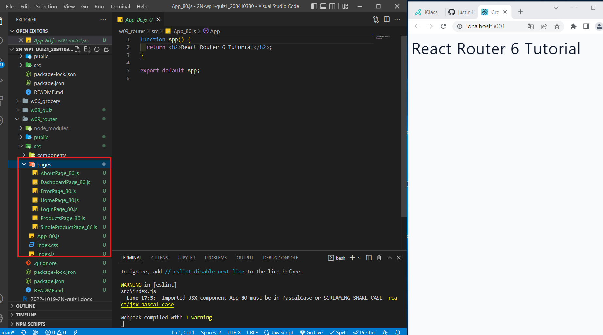
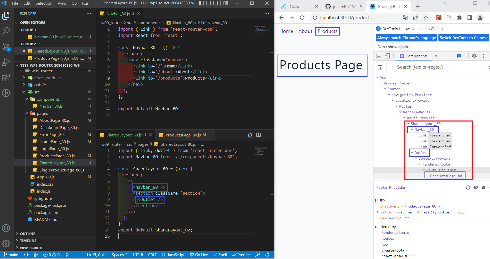
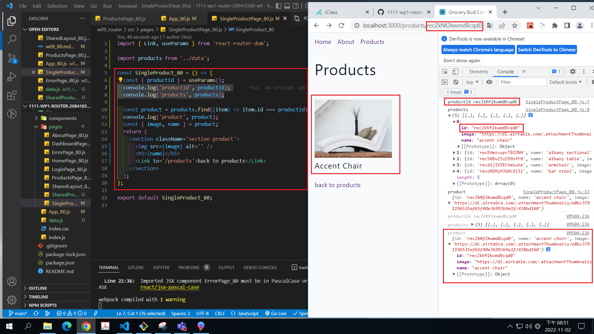
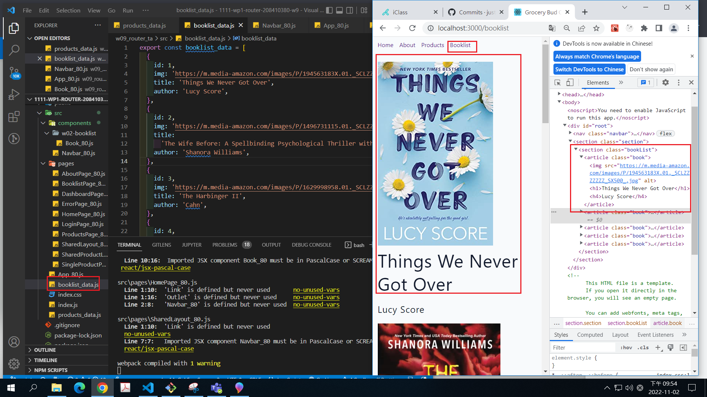
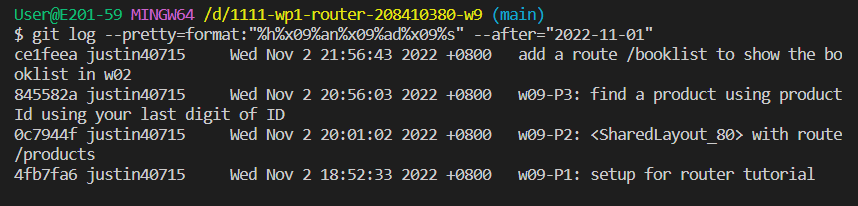

[Github URL] ()

### w09-P1: setup for router tutorial

### w09-P2: <SharedLayout_80> with route/products

### w09-P3: find a product using productId using your last digit of ID

### w09-P4: add a route /booklist to show the booklist in w02

### w09-P5:

git log --pretty=format:"%h%x09%an%x09%ad%x09%s" --after="2022-10-11"
