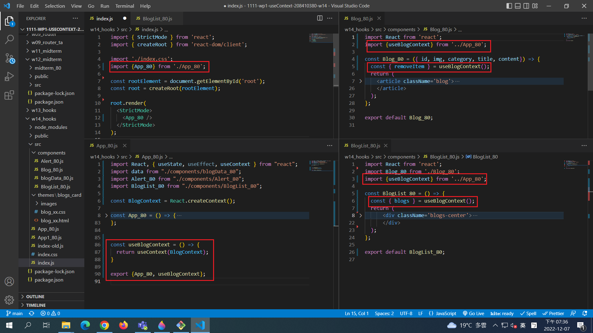

[Github URL] ()

### W14-P1: App1_80 contains BlogList_80, Blog_80 functional components

### W14-P2: App_80, BlogList_80, Blog_80 as separate components

### W14-P3: W14-P3: define BlogContext_xx and use it in <App_xx />, <BlogList_xx />, <Blog_xx /> components

### w14-P4: W14-P4: 說明 w14-p4題目，改寫 w04  menu 使用 p3 之Context API

### w14-P5: W14-P5: show all logs

git log --pretty=format:"%h%x09%an%x09%ad%x09%s" --after="2022-12-07"